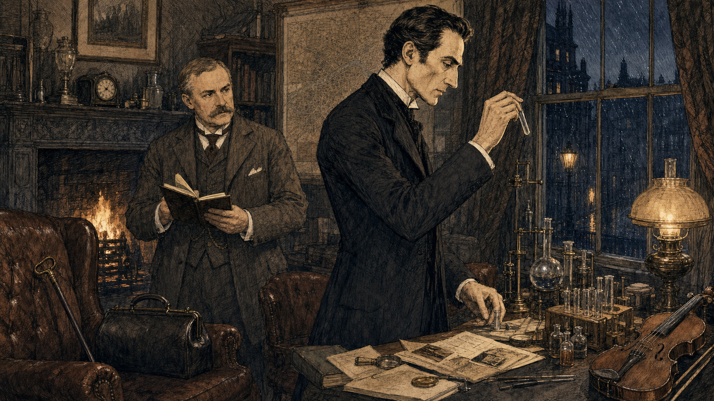

# 夏洛克·福尔摩斯人物总档案｜简介、方法与60桩正典案件时间线

**档案编号：DA-001**

**本期范围：人物简介＋4部长篇＋56篇短篇**

**整理方式：按故事内部时间线，而非作品发表顺序**

如果只用一顶猎鹿帽、一只烟斗和一句口头禅来概括福尔摩斯，我们记住的可能只是改编史塑造出的文化剪影。

柯南·道尔笔下真正耐读的福尔摩斯，更接近一位不断收集证据、比较样本、建立假设，再用行动检验假设的职业调查者。他会观察泥点、纸张、笔迹、烟灰和人的神态，也会化装、追踪、做化学实验、查报纸档案，并让铁路、电报和伦敦街巷成为调查工具。

这份档案不从“最有名的一案”讲起，也不照着出版目录排列。我们先认识这个人，再沿他在故事世界里的生涯，打开全部60篇完整正典故事。

> **无剧透说明**
>
> 下文不会公布凶手、诡计、关键身份或结局。时间线本身会透露福尔摩斯在哪些年份活跃、失踪、复出与退隐；除此之外，谜底仍留在原著中。

## 先说明：为什么这份档案是60案

通常所说的福尔摩斯正典，是阿瑟·柯南·道尔创作的 **4部长篇与56篇短篇，共60篇完整故事**。

另有《田野市集》（The Field Bazaar）和《华生怎样学会了这一招》（How Watson Learned the Trick）两篇特殊短文。部分资料库会把它们一并编号，于是得到“62篇”。本档案把两篇短文放在文末附录，不与60篇完整案件混计。

原著中还提到许多没有被写成完整故事的“旧案”，影视改编和后世续作也增加了大量新案件。它们都值得另行整理，但不混入这份柯南·道尔正典目录。

## 也先说明：这不是唯一正确的年表

柯南·道尔没有为60篇故事留下统一年表，作品中的月份、星期、天气、婚姻状态与历史事件偶尔会互相冲突。因此，任何精确到某一天的完整排序，都包含后世研究者的判断。

本档案采用福尔摩斯研究中常见的 **威廉·巴林-古尔德年表** 作为主轴，同时遵守三条规则：

- 原著明确给出日期时，优先记录原著信息；
- 只能推定时，用“约”“推定”标明，不写成作者确认的事实；
- 存在明显争议时，保留不同说法。

你可以把它看成一张便于继续阅读和讨论的地图，而不是一份不容修改的判决书。

## 人物总档案

**姓名：** 夏洛克·福尔摩斯（Sherlock Holmes）

**创造者：** 阿瑟·柯南·道尔（Arthur Conan Doyle）

**首次登场：** 《血字的研究》，1887年发表于《比顿圣诞年刊》

**职业：** 咨询侦探

**主要住址：** 伦敦贝克街221B

**主要搭档与记录者：** 约翰·H·华生医生

**正典生涯范围：** 早年独立办案、贝克街时期、失踪与归来、苏塞克斯退隐、第一次世界大战前夕的最后任务

### 他到底怎样推理

福尔摩斯最常被记住的是“演绎法”，但他的实际工作远比一句术语丰富。

第一步，是把亲眼所见与他人解释分开。委托人说“有人在跟踪我”，福尔摩斯首先关心的不是这个判断是否惊人，而是对方出现过几次、距离多远、穿着怎样、在哪一段道路上消失。

第二步，是比较。烟灰、泥土、轮胎、打字机、纸张水印和职业习惯之所以有用，是因为他脑中保存着可供对照的样本。

第三步，是提出不止一个解释，再寻找能排除其中大部分解释的证据。他并非永远正确；真正重要的是，他愿意等待、实验，也愿意在证据不支持时修改判断。

最后一步，往往是行动。化装、监听、追踪、夜间潜入、布置诱饵、联系报童与警探，都说明他不是坐在扶手椅里等待答案自动出现的人。

### 他身边最重要的人

**华生** 不只是“负责吃惊的旁观者”。他提供医疗知识、社会经验、行动支援和道德尺度，也把零散调查写成读者能够进入的故事。

**哈德森太太** 维持贝克街日常，让实验、来访者和突发行动有一个稳定的生活背景。

**雷斯垂德等苏格兰场警探** 与福尔摩斯既竞争又合作，代表制度化警务正在成长的时代。

**迈克罗夫特·福尔摩斯** 展示了另一种智力：信息更广、判断更快，却未必愿意离开安乐椅去完成现场工作。

**莫里亚蒂教授** 将个体犯罪背后的组织、网络和调度能力带入福尔摩斯的视野。

**艾琳·艾德勒** 只在一篇完整故事中正面出现，却让福尔摩斯不得不重新衡量自己的判断。

### 他所处的时代

这些案件横跨维多利亚时代晚期和爱德华时代，并延伸到第一次世界大战前夕。

铁路把伦敦与庄园、港口、大学城连接起来；电报压缩了等待消息的时间；廉价报纸、旅馆登记、银行票据和邮政系统留下新的信息痕迹；医学、毒物学、指纹和现场检验仍在形成规范。与此同时，帝国贸易、殖民战争、跨大西洋移民与欧洲政治，也不断把遥远往事带回英国客厅。

读福尔摩斯，不只是看一个人如何猜中答案，也是看现代城市怎样开始制造、保存和追踪证据。

## 60案时间线：从第一桩案件到最后致意

下面按故事内部时间分成六个阶段。每案保留常见中文译名与英文原名；中文译名因版本不同可能略有差异。

## 第一阶段｜早年与独立执业（约1874—1879）

贝克街合租之前，年轻的福尔摩斯已经在朋友、同学和旧家族的秘密中磨练方法。两篇较晚发表的回忆，反而位于人物生涯最前端。

### 001｜《“格洛里亚·斯科特”号》

**原名：** The Gloria Scott ｜ **时间线：** 约1874年夏（推定） ｜ **首次发表：** 1893

**无剧透案情：** 大学时代的福尔摩斯受同学维克多·特雷弗邀请到乡间做客。一封语句古怪的来信，牵出主人多年不愿谈起的海上往事。

**观察点：** 这是福尔摩斯最早自述的案件之一，可以看到他的观察能力怎样第一次被别人当成一门职业。

### 002｜《马斯格雷夫礼典》

**原名：** The Musgrave Ritual ｜ **时间线：** 约1879年秋（推定） ｜ **首次发表：** 1893

**无剧透案情：** 古老家族代代背诵一套看似无意义的问答礼典；管家秘密研究礼典后失踪，一名女仆也随之不见。

**观察点：** 文字谜题、庄园空间和历史记忆被放在同一张图上，显示福尔摩斯早期的测量与重建能力。

## 第二阶段｜贝克街伙伴关系成形（约1881—1886）

华生从阿富汗战场回到伦敦，两人在贝克街开始合租。福尔摩斯从已有少量客户的独立调查者，逐渐成为会被警方、贵族与政府主动求助的咨询侦探。

### 003｜《血字的研究》

**原名：** A Study in Scarlet ｜ **时间线：** 1881年3月（推定） ｜ **首次发表：** 1887

**无剧透案情：** 华生初识福尔摩斯不久，便跟随他进入一所空屋：一名男子倒在房内，墙上留下醒目的单词，现场却拒绝提供一个简单答案。

**观察点：** 这是贝克街组合的起点，也集中展示脚印、车辙、气味、时间估算与侦查网络。

### 004｜《斑点带子案》

**原名：** The Speckled Band ｜ **时间线：** 约1883年4月（推定） ｜ **首次发表：** 1892

**无剧透案情：** 海伦·斯托纳即将结婚，却担心自己会像姐姐一样在封闭卧室中离奇死去。夜间口哨、金属声和一座衰败庄园构成她的恐惧。

**观察点：** 读时可留意卧室里“本来不该这样摆放”的东西，而不必急着寻找异国奇观。

### 005｜《住院的病人》

**原名：** The Resident Patient ｜ **时间线：** 约1886年10月（推定） ｜ **首次发表：** 1893

**无剧透案情：** 医生珀西·特里维廉以一种特殊投资安排开设诊所，出资人布莱辛顿却在神秘访客出现后陷入异常恐慌。

**观察点：** 医疗职业、资本关系和被隐藏的个人史共同决定了谁有资格进入一间诊室。

### 006｜《贵族单身汉案》

**原名：** The Noble Bachelor ｜ **时间线：** 约1886年10月（推定） ｜ **首次发表：** 1892

**无剧透案情：** 一位美国富家女在与英国贵族举行婚礼后突然失踪，婚纱、捧花和一顿无人解释的餐食成为线索。

**观察点：** 福尔摩斯把跨大西洋婚姻看作具体的人生选择，而不仅是上流社会新闻。

### 007｜《第二块血迹》

**原名：** The Second Stain ｜ **时间线：** 约1886年10月（推定） ｜ **首次发表：** 1904

**无剧透案情：** 一份足以引发严重外交后果的文件从大臣家中消失。委托人要求福尔摩斯找回文件，却不能公开它的内容。

**观察点：** 调查的难点不只是“文件在哪里”，还包括谁能承受真相进入公共领域。

## 第三阶段｜贝克街黄金时期与莫里亚蒂阴影（约1887—1891）

这是案件最密集的阶段。城市委托、乡间庄园、跨国旧事和政府机密不断进入贝克街；华生的婚姻与行医，也让两人的合作节奏发生变化。

### 008｜《赖盖特之谜》

**原名：** The Reigate Puzzle / The Reigate Squire ｜ **时间线：** 约1887年4月（推定） ｜ **首次发表：** 1893

**无剧透案情：** 福尔摩斯因过度工作到萨里休养，当地相邻两户人家接连发生盗窃与命案，一张被撕裂的字条留下不完整的信息。

**观察点：** 身体疲惫并没有让他停止工作，反而让“病弱”本身成为调查中的变量。

### 009｜《波希米亚丑闻》

**原名：** A Scandal in Bohemia ｜ **时间线：** 约1887年5月（推定） ｜ **首次发表：** 1891

**无剧透案情：** 一位隐去身份的王室客户希望取回艾琳·艾德勒手中的照片。福尔摩斯为此观察住处、跟踪日常，并设计一场街头试验。

**观察点：** 这不是浪漫传说的注脚，而是一堂关于偏见、尊重与对手自主性的课。

### 010｜《歪唇男人》

**原名：** The Man with the Twisted Lip ｜ **时间线：** 约1887年6月（推定） ｜ **首次发表：** 1891

**无剧透案情：** 体面的内维尔·圣克莱尔在伦敦一间鸦片烟馆附近失踪，妻子却坚信自己曾从楼上窗口看到他。

**观察点：** 城市身份、职业表演与人们“愿意看见什么”比一张怪异的脸更重要。

### 011｜《五个橘核》

**原名：** The Five Orange Pips ｜ **时间线：** 约1887年9月（推定） ｜ **首次发表：** 1891

**无剧透案情：** 年轻人约翰·奥彭肖带来一组家族旧事：几封装有橘核的警告信出现后，亲属接连遭遇死亡。

**观察点：** 邮戳、航程和天气把英国乡间与美国历史连接起来，也提醒读者福尔摩斯并非每次都能控制时间。

### 012｜《身份案》

**原名：** A Case of Identity ｜ **时间线：** 约1887年10月（推定） ｜ **首次发表：** 1891

**无剧透案情：** 玛丽·萨瑟兰的未婚夫在婚礼当天消失。对方坚持打字通信、避免清晰见面，并要求她作出不同寻常的承诺。

**观察点：** 打字机、家庭财产和女性就业共同构成案件，而“看似关心你的人”未必没有利益。

### 013｜《红发会》

**原名：** The Red-Headed League ｜ **时间线：** 约1887年10月（推定） ｜ **首次发表：** 1891

**无剧透案情：** 当铺老板因红发获得一份高薪抄写工作，数周后组织突然解散。荒诞招聘背后显然还有另一套时间表。

**观察点：** 先问“谁希望他在固定时段离开原地”，再看街区、地下空间与邻近建筑。

### 014｜《临终的侦探》

**原名：** The Dying Detective ｜ **时间线：** 约1887年11月（推定） ｜ **首次发表：** 1913

**无剧透案情：** 华生被告知福尔摩斯身患致命疾病，不能接受普通医生诊治；一位对罕见病十分熟悉的人随后被请到贝克街。

**观察点：** 当医生必须遵守病人的限制，友情、专业判断和表演之间会产生怎样的张力。

### 015｜《蓝宝石案》

**原名：** The Blue Carbuncle ｜ **时间线：** 约1887年圣诞后（推定） ｜ **首次发表：** 1892

**无剧透案情：** 一顶旧帽子和一只圣诞鹅被送到贝克街，随后与失窃的珍贵宝石发生联系。

**观察点：** 从普通物品追踪供应链，是这篇故事最轻盈也最现代的乐趣。

### 016｜《恐怖谷》

**原名：** The Valley of Fear ｜ **时间线：** 约1888年1月（推定） ｜ **首次发表：** 1914—1915

**无剧透案情：** 一封加密警告指向伯尔斯通庄园；命案发生后，现场证据与在场者的解释彼此抵牾，另一段美国往事又把案件拉向更远处。

**观察点：** 暗号、封闭现场、身份与组织化犯罪在此叠合，莫里亚蒂的影响尚未现身便已形成压力。

### 017｜《黄面人》

**原名：** The Yellow Face ｜ **时间线：** 约1888年4月（推定） ｜ **首次发表：** 1893

**无剧透案情：** 格兰特·芒罗发现妻子向自己隐瞒一座邻近小屋的秘密，窗口偶尔出现一张令他不安的脸。

**观察点：** 这篇故事最值得保存的，不是一次漂亮命中，而是福尔摩斯面对错误时的态度。

### 018｜《希腊译员》

**原名：** The Greek Interpreter ｜ **时间线：** 约1888年9月（推定） ｜ **首次发表：** 1893

**无剧透案情：** 译员梅拉斯被蒙眼带到陌生宅邸，被迫替被囚禁的希腊人传话；迈克罗夫特·福尔摩斯也由此进入华生的记录。

**观察点：** 翻译并非中性通道；谁能提问、谁能回答，以及能否在措辞中偷偷传递信息，决定了现场权力。

### 019｜《四签名》

**原名：** The Sign of Four ｜ **时间线：** 约1888年9月（推定） ｜ **首次发表：** 1890

**无剧透案情：** 玛丽·莫斯坦多年来定期收到珍珠，如今又得到一封神秘邀约。失踪父亲、印度宝藏与四人签名逐渐汇入伦敦。

**观察点：** 泰晤士河、蒸汽船、电报和街头协作者，让这篇长篇成为一张会移动的城市调查图。

### 020｜《巴斯克维尔的猎犬》

**原名：** The Hound of the Baskervilles ｜ **时间线：** 约1888年秋（推定） ｜ **首次发表：** 1901—1902

**无剧透案情：** 巴斯克维尔家族据说受到魔犬诅咒，查尔斯爵士死在荒原边缘，新继承人即将回到祖宅。

**观察点：** 故事并不要求读者嘲笑恐惧，而是让地形、传说、天气和人心共同解释恐惧如何变得真实。

### 021｜《铜山毛榉案》

**原名：** The Copper Beeches ｜ **时间线：** 约1889年4月（推定） ｜ **首次发表：** 1892

**无剧透案情：** 家庭教师维奥莱特·亨特得到一份报酬优厚的职位，条件却包括剪短头发、穿指定衣服和在固定位置面向窗外。

**观察点：** 当工作合同开始规定一个人的身体与视线，异常本身就已经是证据。

### 022｜《博斯科姆比溪谷秘案》

**原名：** The Boscombe Valley Mystery ｜ **时间线：** 约1889年6月（推定） ｜ **首次发表：** 1891

**无剧透案情：** 一名地主在水塘附近遇害，刚与他争吵过的儿子成为最明显的嫌疑人，现场证词似乎也指向同一结论。

**观察点：** 脚印、伤口与死者最后的词语，要放回具体地形中才有意义。

### 023｜《证券经纪人的书记员》

**原名：** The Stockbroker’s Clerk ｜ **时间线：** 约1889年6月（推定） ｜ **首次发表：** 1893

**无剧透案情：** 失业的霍尔·派克罗夫特刚获伦敦公司录用，又被另一家公司以高薪请往伯明翰，手续和人员却处处重复得不自然。

**观察点：** “好得不像真的”工作机会如何利用求职者的焦虑，是这篇故事至今仍熟悉的部分。

### 024｜《海军协定》

**原名：** The Naval Treaty ｜ **时间线：** 约1889年7—8月（推定） ｜ **首次发表：** 1893

**无剧透案情：** 外交文件在珀西·费尔普斯的办公室里短暂无人看守时消失，职业、家庭与国家安全同时压在他身上。

**观察点：** 注意办公室动线、门铃、楼梯与谁知道文件存在；机密案件首先是一场权限调查。

### 025｜《纸盒子》

**原名：** The Cardboard Box ｜ **时间线：** 约1889年8—9月（推定） ｜ **首次发表：** 1893

**无剧透案情：** 一位安静生活的女士收到装有两只人耳的纸盒，包裹来源与收件人表面上毫无关联。

**观察点：** 包装、绳结、盐和人体细节让“邮寄物”成为完整现场；篇章涉及遗体，但不依赖猎奇。

### 026｜《工程师大拇指案》

**原名：** The Engineer’s Thumb ｜ **时间线：** 约1889年9月（推定） ｜ **首次发表：** 1892

**无剧透案情：** 水力工程师维克多·哈瑟利被高薪请到偏僻地点检查机器，委托人严格保密；他在逃出后带着严重手伤求助华生。

**观察点：** 路程、报价和机器用途彼此不匹配时，专业知识既是进入危险的门票，也是识破骗局的工具。

### 027｜《驼背人》

**原名：** The Crooked Man ｜ **时间线：** 约1889年9月（推定） ｜ **首次发表：** 1893

**无剧透案情：** 巴克莱上校与妻子争吵后死在反锁房间里，现场出现陌生脚印和一种不寻常动物的痕迹。

**观察点：** 一段殖民战争中的旧事如何被家庭记忆压住，又怎样在多年后返回英国客厅。

### 028｜《紫藤居》

**原名：** Wisteria Lodge ｜ **时间线：** 约1890年3月（推定） ｜ **首次发表：** 1908

**无剧透案情：** 斯科特·埃克尔斯受邀在紫藤居过夜，醒来后发现主人与仆人全部消失；随后，房屋又与一桩命案相连。

**观察点：** 私人宴请背后藏着跨国政治与流亡者网络，苏格兰场也在同步推进调查。

### 029｜《银色马》

**原名：** Silver Blaze ｜ **时间线：** 约1890年9月（推定） ｜ **首次发表：** 1892

**无剧透案情：** 冠军赛马“银色马”在大赛前失踪，练马师死于荒原，马厩男孩则失去意识。

**观察点：** 看守犬的反应、羊群的小变化和赛马产业的利益关系，比“神奇直觉”更接近谜题核心。

### 030｜《绿玉皇冠案》

**原名：** The Beryl Coronet ｜ **时间线：** 约1890年12月（推定） ｜ **首次发表：** 1892

**无剧透案情：** 银行家暂时保管一顶珍贵皇冠，夜间发现宝石缺失，自己的儿子又手持受损皇冠站在现场。

**观察点：** 表面证据过于整齐时，福尔摩斯会转向雪地、窗户和家庭成员没有说出口的动机。

### 031｜《最后一案》

**原名：** The Final Problem ｜ **时间线：** 1891年4—5月 ｜ **首次发表：** 1893

**无剧透案情：** 福尔摩斯向华生说明莫里亚蒂教授及其犯罪网络，并在追捕压力下离开英国，穿越欧洲前往瑞士。

**观察点：** 案件从单一现场扩大为系统对系统的较量；“谁能调动更多节点”比一件孤立物证更重要。

## 第四阶段｜归来后的伦敦（约1894—1897）

数年空白之后，贝克街重新开门。案件的尺度从大学考试、乡村庄园到国家军事计划不等，福尔摩斯与警方的合作也更成熟。

### 032｜《空屋》

**原名：** The Empty House ｜ **时间线：** 1894年4月 ｜ **首次发表：** 1903

**无剧透案情：** 伦敦发生一桩从外部难以解释的室内枪击案；与此同时，华生生活中一段被认为已经结束的关系重新开启。

**观察点：** 一所“空屋”既是观察点，也是诱饵；视线从哪里射入，比房间是否上锁更关键。

### 033｜《金边夹鼻眼镜》

**原名：** The Golden Pince-Nez ｜ **时间线：** 约1894年11月（推定） ｜ **首次发表：** 1904

**无剧透案情：** 教授的秘书在书房遇害，临终前留下含混话语；现场最突出的物证是一副金边夹鼻眼镜。

**观察点：** 眼镜不仅能辨认佩戴者，也会改变佩戴者看见空间的方式；俄国革命往事则藏在英国家庭内部。

### 034｜《三个大学生》

**原名：** The Three Students ｜ **时间线：** 约1895年4月（推定） ｜ **首次发表：** 1904

**无剧透案情：** 一份尚未开考的希腊文试卷被人翻动，能接近房间的三名学生各有不同处境。

**观察点：** 铅笔屑、桌面划痕和泥土必须与人的身高、运动能力及未来压力一起判断。

### 035｜《孤身骑车人》

**原名：** The Solitary Cyclist ｜ **时间线：** 约1895年4月（推定） ｜ **首次发表：** 1904

**无剧透案情：** 音乐教师维奥莱特·史密斯每周骑车往返车站，途中总被一名保持距离的陌生骑车人跟随。

**观察点：** 开阔乡路看似一览无余，却因距离、岔路和社会礼仪制造了新的盲区。

### 036｜《黑彼得》

**原名：** Black Peter ｜ **时间线：** 约1895年7月（推定） ｜ **首次发表：** 1904

**无剧透案情：** 以凶悍著称的前捕鲸船长在自家木屋中被鱼叉刺死，桌上留下朗姆酒、烟草与陌生笔记本。

**观察点：** 海上职业经验会改变一个人的力量、习惯与饮酒选择，不能用普通室内案件的尺度测量。

### 037｜《诺伍德的建筑师》

**原名：** The Norwood Builder ｜ **时间线：** 约1895年8月（推定） ｜ **首次发表：** 1903

**无剧透案情：** 年轻律师刚替一名建筑师拟好遗嘱，对方即在火灾后失踪；手杖、血迹与指纹迅速把他推到被告席。

**观察点：** 当证据“及时”出现并完美补齐警方叙事时，出现的时机本身就是证据。

### 038｜《布鲁斯-帕廷顿计划》

**原名：** The Bruce-Partington Plans ｜ **时间线：** 约1895年11月（推定） ｜ **首次发表：** 1908

**无剧透案情：** 一名政府职员的遗体出现在地铁车顶附近，随身携带的潜艇图纸少了最关键的几张。

**观察点：** 伦敦地下铁路的线路、车厢运动与雾天环境，共同把城市基础设施变成现场。

### 039｜《戴面纱的房客》

**原名：** The Veiled Lodger ｜ **时间线：** 约1896年10月（推定） ｜ **首次发表：** 1927

**无剧透案情：** 一位长期遮面、极少出门的房客请福尔摩斯听她讲述多年前巡回马戏团中的悲剧。

**观察点：** 这更像一份迟到的证言档案；福尔摩斯的工作，是判断公开、沉默与补偿各自意味着什么。

### 040｜《苏塞克斯吸血鬼》

**原名：** The Sussex Vampire ｜ **时间线：** 约1896年11月（推定） ｜ **首次发表：** 1924

**无剧透案情：** 一名父亲怀疑秘鲁妻子伤害婴儿，“吸血鬼”一词由此进入委托，但家庭成员的动作与沉默并不支持简单怪谈。

**观察点：** 福尔摩斯首先排除的，往往是问题里最醒目的标签。

### 041｜《失踪的中卫》

**原名：** The Missing Three-Quarter ｜ **时间线：** 约1896年12月（推定） ｜ **首次发表：** 1904

**无剧透案情：** 剑桥橄榄球队的重要球员在大赛前从旅馆失踪，只留下一封未寄出的电报和匆忙离开的痕迹。

**观察点：** 体育荣誉只是公开压力；私人关系、医疗信息与出租马车构成另一条路线。

### 042｜《格兰其庄园》

**原名：** The Abbey Grange ｜ **时间线：** 约1897年1月（推定） ｜ **首次发表：** 1904

**无剧透案情：** 庄园男主人遇害，妻子被捆绑，现场被解释为一伙著名盗贼所为。

**观察点：** 酒杯、绳结与壁炉提供物理证据，但福尔摩斯还必须判断法律结论与正义是否总能重合。

### 043｜《魔鬼之足》

**原名：** The Devil’s Foot ｜ **时间线：** 约1897年3月（推定） ｜ **首次发表：** 1910

**无剧透案情：** 福尔摩斯在康沃尔休养时，一家人在打牌后分别死亡或精神失常，房间里没有明显闯入痕迹。

**观察点：** 他和华生用危险实验验证假设，也让读者看见早期毒物研究的代价。

## 第五阶段｜后期合作与退隐前夕（约1898—1903）

两人的经验已经足以迅速识别旧套路，但新世纪也带来新的职业、交通与犯罪组织。福尔摩斯有时亲自叙述，华生不再是唯一的记录声音。

### 044｜《跳舞的小人》

**原名：** The Dancing Men ｜ **时间线：** 约1898年夏（推定） ｜ **首次发表：** 1903

**无剧透案情：** 诺福克庄园接连出现由火柴人图形组成的留言，美国出生的女主人见到它们后极度恐惧，却拒绝解释。

**观察点：** 密码不是悬空的智力游戏；重复符号、词频和信息出现地点共同决定如何破译。

### 045｜《退休的颜料商》

**原名：** The Retired Colourman ｜ **时间线：** 约1898年7月（推定） ｜ **首次发表：** 1926

**无剧透案情：** 退休商人乔赛亚·安伯利声称妻子与棋友私奔，并带走积蓄；屋内弥漫的新油漆气味却令人分心。

**观察点：** 报案人的叙述也是现场的一部分，过度展示的受害者身份需要同样接受检验。

### 046｜《查尔斯·奥古斯特·米尔沃顿》

**原名：** Charles Augustus Milverton ｜ **时间线：** 约1899年1月（推定） ｜ **首次发表：** 1904

**无剧透案情：** 一名专门收集私人书信的勒索者威胁福尔摩斯的委托人，并把法律边界当成自己的护城河。

**观察点：** 当证据掌握在职业勒索者手中，调查会逼近侦探本人愿意越过的道德与法律边界。

### 047｜《六座拿破仑半身像》

**原名：** The Six Napoleons ｜ **时间线：** 约1900年6月（推定） ｜ **首次发表：** 1904

**无剧透案情：** 伦敦多处的拿破仑石膏像被接连砸碎，其中一次破坏又与命案相连。

**观察点：** 先追踪同批商品如何制造、出售和转手，再判断破坏者究竟在恨什么或找什么。

### 048｜《雷神桥之谜》

**原名：** The Problem of Thor Bridge ｜ **时间线：** 约1900年10月（推定） ｜ **首次发表：** 1922

**无剧透案情：** 家庭教师格蕾丝·邓巴被控在桥边枪杀雇主的妻子，手枪、字条与动机似乎都已齐全。

**观察点：** 桥栏、落点和物体运动能否复现，比“谁看起来最像嫌疑人”更有说服力。

### 049｜《修道院公学》

**原名：** The Priory School ｜ **时间线：** 约1901年5月（推定） ｜ **首次发表：** 1904

**无剧透案情：** 公爵的独子与一名德语教师同时从寄宿学校失踪，自行车痕迹一路伸向荒原。

**观察点：** 不同轮胎、牛蹄与地图上的道路，让追踪成为一场对地面痕迹的阅读。

### 050｜《肖斯科姆老宅》

**原名：** Shoscombe Old Place ｜ **时间线：** 约1902年5月（推定） ｜ **首次发表：** 1927

**无剧透案情：** 赛马训练师担心雇主行为突然改变：宠物被送走、夜里有人出入旧礼拜堂，重要赛事又迫在眉睫。

**观察点：** 赛马产业的债务与继承安排，为看似阴森的旧宅异象提供现实压力。

### 051｜《三个同姓人》

**原名：** The Three Garridebs ｜ **时间线：** 约1902年6月（推定） ｜ **首次发表：** 1924

**无剧透案情：** 一笔美国遗产要求找到三名姓加里德布的人，伦敦收藏家因罕见姓氏被卷入一场跨国寻人。

**观察点：** 姓名、广告和伪造履历很容易制造“验证已经完成”的错觉；华生与福尔摩斯的情谊也在危急时刻显露。

### 052｜《弗朗西丝·卡法克斯女士的失踪》

**原名：** The Disappearance of Lady Frances Carfax ｜ **时间线：** 约1902年7月（推定） ｜ **首次发表：** 1911

**无剧透案情：** 独自旅行的弗朗西丝女士在欧洲旅途中停止通信，随身珠宝与一对新结识的人物都令华生不安。

**观察点：** 旅馆、银行汇款和跨境通信显示，独立旅行既带来自由，也制造追踪空白。

### 053｜《显贵的主顾》

**原名：** The Illustrious Client ｜ **时间线：** 约1902年9月（推定） ｜ **首次发表：** 1924

**无剧透案情：** 一位不愿公开身份的重要人物，希望阻止年轻女子嫁给有危险往事的格鲁纳男爵。

**观察点：** 福尔摩斯不能只提供指控，还必须面对“一个人为什么拒绝相信不利证据”。

### 054｜《红圈会》

**原名：** The Red Circle ｜ **时间线：** 约1902年9月（推定） ｜ **首次发表：** 1911

**无剧透案情：** 房东发现新房客足不出户、只用纸条订餐，夜间又有人从窗边发送信号；线索通向跨大西洋犯罪组织。

**观察点：** 食物、语言、手写纸条和灯光信号共同回答“房间里的人是否还是最初入住的人”。

### 055｜《皮肤变白的军人》

**原名：** The Blanched Soldier ｜ **时间线：** 约1903年1月（推定） ｜ **首次发表：** 1926

**无剧透案情：** 南非战争归来的詹姆斯·多德寻找突然断绝来往的战友戈弗雷·埃姆斯沃思，战友家人却坚持他已远行。

**观察点：** 这篇由福尔摩斯本人叙述，战争创伤、疾病污名和庄园隔离比“失踪”二字更复杂。

### 056｜《三面山墙》

**原名：** The Three Gables ｜ **时间线：** 约1903年5月（推定） ｜ **首次发表：** 1926

**无剧透案情：** 寡居的玛丽·梅伯利收到古怪报价：买家不仅要房屋，还要求连同屋内全部物品一起收购。

**观察点：** 当对方不在乎房地产价值却在乎“一件都不能带走”，调查重点便转向物品目录和逝者留下的文字。

### 057｜《马扎林宝石》

**原名：** The Mazarin Stone ｜ **时间线：** 约1903年夏（推定） ｜ **首次发表：** 1921

**无剧透案情：** 王室宝石失窃，福尔摩斯锁定危险人物，却必须让对方在贝克街暴露宝石所在。

**观察点：** 蜡像、房间视线与声音误导组成一场舞台化布局；本篇采用第三人称叙述。

### 058｜《爬行人》

**原名：** The Creeping Man ｜ **时间线：** 约1903年9月（推定） ｜ **首次发表：** 1923

**无剧透案情：** 一位年长教授准备再婚后开始出现古怪的夜间行为，家犬也对主人产生异常敌意。

**观察点：** 故事反映当时社会对衰老、返老还童与实验医学的想象；其中科学设定应放回时代阅读。

## 第六阶段｜苏塞克斯退隐与最后任务（1907／1909—1914）

福尔摩斯离开伦敦，在苏塞克斯研究蜜蜂。案件数量骤减，叙述角度也发生变化；但退隐并不等于停止观察。

### 059｜《狮鬃毛》

**原名：** The Lion’s Mane ｜ **时间线：** 原著指向1907年7月底；巴林-古尔德年表推定为1909年7—8月 ｜ **首次发表：** 1926

**无剧透案情：** 苏塞克斯海滩上一名教师突然倒下，临终前只说出“狮鬃毛”；另一人随后也遭遇类似危险。

**观察点：** 这是由福尔摩斯本人叙述的退隐案件。海岸生态与自然观察取代伦敦街巷，也留下正典年表中最醒目的日期争议之一。

### 060｜《最后致意》

**原名：** His Last Bow ｜ **时间线：** 1914年8月2日 ｜ **首次发表：** 1917

**无剧透案情：** 第一次世界大战爆发前夜，一名德国情报人员等待最后一批英国军事情报；一场长期卧底行动即将收网。

**观察点：** 这篇第三人称故事把私人咨询侦探放进国家情报战，也为跨越数十年的生涯留下真正的时代终点。

## 把60案放在一起，我们能看见什么

福尔摩斯的生涯不是一条从“不会推理”到“永远正确”的升级线。

早年案件里，他学会把观察变成可以受人委托的职业；贝克街时期，他与华生、警方和城市信息网络建立稳定协作；莫里亚蒂让他看见犯罪也可以像机构一样运行；归来之后，他更频繁地面对法律与正义不完全重合的情形；退隐时期，他仍然观察，却不再需要伦敦和公众掌声证明自己的身份。

60篇故事也记录了侦探小说形式本身的变化：第一人称回忆、长篇双层叙事、密码故事、失踪案、国家机密、心理误导、科学幻想与间谍故事，都被装进同一只档案箱。

所以，接下来逐案整理时，我们不会只问“谜底难不难猜”，还会问：

- 这时的福尔摩斯处在人生哪个阶段？
- 华生是否在场，又以怎样的方式记录？
- 铁路、电报、报纸、银行与法律如何影响调查？
- 某个细节来自原著，还是来自后来改编？
- 不揭晓谜底的前提下，这一案最值得保存的观察方法是什么？

## 两篇特殊短文：为什么另列

**《田野市集》**（The Field Bazaar，1896）篇幅很短，最初为爱丁堡大学学生刊物的募捐活动而写。它以华生视角呈现一次熟悉的“从细节读出经历”，但并非一桩完整案件。

**《华生怎样学会了这一招》**（How Watson Learned the Trick，1924）同样是短小的戏仿式场景：华生尝试模仿福尔摩斯的观察推理。它更像角色小品，而不是第61案。

把它们保留在附录，既不会丢失柯南·道尔亲自写下的福尔摩斯文本，也不会改变“4部长篇＋56篇短篇”的通行正典口径。

## 下一只档案盒，从哪里打开

如果按人物经历继续，下一篇个案档案应当从《“格洛里亚·斯科特”号》开始，而不是《血字的研究》。

前者让我们看到福尔摩斯还没有贝克街、没有华生，也没有“咨询侦探”这块成熟招牌时，第一次意识到自己的观察可以成为一种能力。

你最希望个案档案重点记录哪类细节？

- 案件发生地点与路线
- 时代职业、交通和通信
- 福尔摩斯的观察与实验
- 不同中文译名与版本

欢迎留言选择，也可以直接写下你最想先打开的一案。请继续遵守同一条规则：不在留言区公布谜底。

---

## 资料来源与口径

- Conan Doyle Estate：标准正典由4部长篇与56篇短篇组成
  https://conandoyleestate.com/news/on-this-day-in-history-arthur-conan-doyles-a-study-in-scarlet-was-first-published

- The Arthur Conan Doyle Encyclopedia：完整故事目录，以及两篇特殊短文的扩展口径
  https://www.arthur-conan-doyle.com/wiki/The_62_Sherlock_Holmes_stories_written_by_Arthur_Conan_Doyle

- The Dallas–Fort Worth Sherlock Holmes Society：基于William S. Baring-Gould体系整理的正典内部时间线
  https://www.dfw-sherlock.org/uploads/3/7/3/8/37380505/the_sherlock_holmes_canon_timeline_--_april_2015.pdf

- The Cambridge Companion to Sherlock Holmes：正典与创作、发表年代大事记
  https://www.cambridge.org/core/books/abs/cambridge-companion-to-sherlock-holmes/chronology/040EEA02A5AE8B15FF3C33A3A7DB28C2

- William Nelles：关于福尔摩斯年表重建传统的研究
  https://doi.org/10.1111/lic3.12767

- Project Gutenberg：阿瑟·柯南·道尔公共领域电子文本入口
  https://www.gutenberg.org/ebooks/author/69

## 版权与制作说明

本文为原创人物介绍、资料整理与无剧透导读，不复制小说正文，不使用影视改编画面或演员肖像。人物及作品名称仅用于评论、介绍与资料索引。

封面与正文时间线图由AI辅助生成，经人工确定主题、构图、取舍与排版；图中不表现任何现成影视或动漫角色。

不同地区对原著文本、译本和图像的版权状态可能不同。转载、翻译或使用原文前，请依据所在地法律及具体版本授权情况另行核对。
