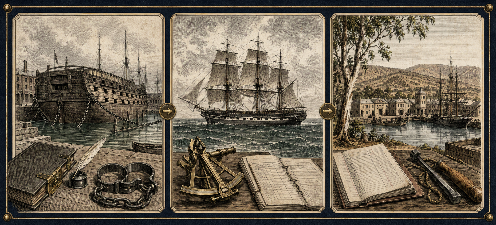

# 福尔摩斯档案001｜“格洛里亚·斯科特”号：一个侦探如何发现自己的天赋

**档案编号：SH-001-GLOR**

**原名：The Adventure of the “Gloria Scott”**

**人物阶段：大学时期，尚未认识华生**

**时间线位置：福尔摩斯正典生涯第1案**

**故事时间：原著只写大学长假；约1874年是巴林-古尔德年表的推定**

**首次发表：1893年4月，《海滨杂志》（The Strand Magazine）**

**收录：《福尔摩斯回忆录》（The Memoirs of Sherlock Holmes）**

> **无剧透边界**
>
> 本文只讨论故事开端、人物阶段、观察方法和真实历史背景，不说明灰色便笺的读法，不揭示船上旧事、人物真实身份与结局。

我们熟悉的福尔摩斯，通常已经坐在贝克街的扶手椅里：华生在旁记录，苏格兰场来敲门，委托人知道自己正在向谁求助。

《“格洛里亚·斯科特”号》里的他却什么都还没有。

没有贝克街221B，没有职业名声，也没有把“咨询侦探”写在名片上。他只是一个不太合群的大学生，喜欢独自在房间里整理自己的思考方法。这个后来被无数人认识的侦探，此时甚至没有认真想过：观察别人留下的细小痕迹，也可以成为一项职业。

这就是它适合作为第一份案件档案的原因。

它不是按发表顺序出现的第一篇，却是人物时间线上的第一道门。

## 一场并不传奇的友谊

青年福尔摩斯在大学里几乎没有朋友。

原著中的他不喜欢社交，除了击剑和拳击，也很少参加同龄人的活动。他研究的方向与别人不同，平时更愿意留在自己的房间里。维克多·特雷弗是他大学两年间结交的唯一朋友，两人认识的方式却一点也不浪漫：特雷弗的牛头梗咬住了福尔摩斯的脚踝，让他卧床十天；特雷弗前来探望，短短的问候逐渐变成长谈。

他们性格几乎相反。特雷弗热情、有活力，福尔摩斯则安静、疏离。但两人都缺少朋友，也能找到共同话题。学期结束时，特雷弗邀请福尔摩斯到父亲位于诺福克的乡间住宅度过一个月长假。

这段开场很重要，因为它让我们看见福尔摩斯后来经常被忽略的一面：他并非没有建立关系的能力，只是很少遇到真正可以靠近的人。

华生还没有出现，特雷弗先成为了那个把他带出房间的人。

## 在诺福克，一次观察改变了方向

特雷弗家的住宅位于诺福克沼泽与水道地区。老宅由红砖和橡木构成，门前有椴树大道，周围可以打野鸭、钓鱼；特雷弗先生是当地地主和治安法官，富有、强壮，见过不少世面，也以仁慈和量刑宽厚闻名。

晚餐后的谈话中，维克多提起朋友已经形成的一套观察与推断方法。父亲以为儿子夸大了，便请青年福尔摩斯从自己身上试一试。

福尔摩斯没有使用神秘仪器，也没有掌握秘密档案。他只是把一个人身体、习惯和随身痕迹中已经存在的信息，重新排列成一段可能的人生经历。

这些判断大多让主人惊讶，其中一项却让他的脸色骤然改变。

原著没有把这个时刻写成掌声中的胜利。恰恰相反，福尔摩斯第一次真正感受到：准确的观察可能刺中别人极力保护的往事。推理不只是展示聪明，也会进入一个人的恐惧、羞耻和安全边界。

特雷弗先生恢复镇定后对他说，现实与小说中的侦探在他面前都会像孩子；这应当成为他一生的方向。

福尔摩斯后来告诉华生，正是这句话第一次让他想到：此前仅仅作为爱好的能力，也许可以变成一种职业。

## 他观察的不是“奇迹”，而是痕迹的组合

如果把这段阅读成“福尔摩斯看一眼就知道一切”，最值得学习的部分反而会消失。

他的判断依靠几种非常具体的动作。

- **观察持续时间。** 他不只看一个人现在怎样，还判断某种习惯或警戒在身体上留下了多久。
- **区分生活痕迹。** 手、耳、皮肤、衣着和动作分别记录职业、运动、旅行与日常习惯，不能全部用同一种解释覆盖。
- **寻找主动遮盖。** 一处已经变淡、却仍能辨认的旧痕迹，意义可能不只在于“它是什么”，还在于主人曾经希望它消失。
- **用反应校正判断。** 对方的惊讶、轻松或恐惧不是谜底，却能告诉调查者：自己的推断触碰到了哪一层信息。

这里已经出现了成熟福尔摩斯方法的雏形：物理痕迹、人物行为和心理反应相互验证。

但他还没有完全学会怎样控制这项能力的力度。大学时期的福尔摩斯能看见秘密，却未必预料到秘密被看见时会给人造成什么。

## 一张看似荒唐的灰色便笺

故事并不是由一具尸体开始的。

多年后，贝克街炉火旁的福尔摩斯从抽屉里取出一只失去光泽的小圆筒，把一张写在灰色纸上的便笺交给华生。纸上的话读起来像是猎物、看守人和农庄事务的混乱组合；华生看不出它为何足以让一个强壮的人受到致命惊吓。

这张便笺告诉我们，信息的威力并不由表面措辞决定。

同一句话，对不知道背景的人可能只是胡言乱语；对掌握共同经历的人，却可能是一记精准警报。读者此时不需要立即破解它，只要先问三个问题：

1. 写信的人假定收信人知道什么？
2. 哪些词像正常内容，哪些词只是为了让句子看起来正常？
3. 为什么传递者不能直接把危险写出来？

答案留给原著。这份档案只保存一个阅读动作：先观察信息在人物身上产生的反应，再判断信息本身。

## 为什么一艘船会藏在英国乡间的过去里

书名中的“格洛里亚·斯科特”是一艘帆船。只知道这一点，不会破坏谜题；相反，它能帮助我们理解故事为什么不断把诺福克乡间与更遥远的海上世界叠在一起。

18世纪末至19世纪，英国长期使用“流放”作为刑罚，把大量被判刑者送往海外殖民地。英国国家档案馆的资料显示，1787年至1868年间，超过16万名英国和爱尔兰囚犯被运往澳大利亚。

等待运输的人有时会被关在“监狱船”上。这些船通常是退役舰船，固定停泊在港口附近，原本被当作监狱拥挤时的临时办法，却延续了近百年。囚犯登记册记录姓名、罪行、判决和去向；海运船只再把他们送往海外。

需要注意的是，**监狱船与运囚船不是完全相同的概念**：前者通常停泊，用来拘禁等待处理或运输的人；后者负责远洋航行。柯南·道尔故事中的“格洛里亚·斯科特”属于后者。

原著还把它的旧航程明确放在1855年，即克里米亚战争期间。故事解释说，一些大型旧船被投入黑海运输，政府因而使用较小、条件较差的船运送囚犯。这里是小说为剧情设置的具体背景；真实历史可以帮助理解制度和船舶类型，却不能反过来证明小说中每一项航程细节都是真实档案。

## 这到底是不是1874年的案件

原著没有写出青年福尔摩斯拜访特雷弗家的确切年份。

它只提供了大学时期、长假、随后七周化学实验，以及秋季渐深等内部线索。后世研究者为了把60篇正典排成完整生涯年表，给出了不同答案：威廉·巴林-古尔德把故事起点放在1874年7月12日，杰伊·芬利·克里斯特则提出1876年9月。

因此，本档案把它写作：

> **约1874年夏（巴林-古尔德年表推定）；确切年份在原著中未定。**

无论选择哪套年表，都不影响一个更可靠的结论：这件事发生在福尔摩斯认识华生之前，而且由他本人称为第一次真正参与的案件。

## 一个还不会称自己为侦探的福尔摩斯

这篇故事中的青年福尔摩斯，已经具备后来最醒目的能力，却还没有成熟职业人的边界。

他习惯独处，热衷化学实验，对别人留下的痕迹极其敏感；接到朋友求助时，也会立刻放下手上的研究返回诺福克。但他此时没有固定工作流程，没有警方资源，也没有华生帮助他平衡事实与人的感受。

《“格洛里亚·斯科特”号》并不是一份完美的“第一案履历”。福尔摩斯没有从开头掌控全局，许多关键事实也不是靠现场推断得到的。

正因为如此，它才像真正的起点。

职业不是在某次漂亮解答完成后凭空出现的。它开始于一个旁观者突然告诉你：你一直认真做的这件事，也许具有别人需要的价值。

对福尔摩斯而言，那个人是特雷弗先生。

那句话没有立刻给他一间贝克街客厅，却改变了他观察自己天赋的方式。

## 无剧透阅读清单

正式阅读时，可以留意以下细节，不必急着猜结局：

- 福尔摩斯怎样描述大学时期的自己；
- 特雷弗父子分别如何回应他的观察；
- 一个新来者进入老宅后，家庭权力关系怎样改变；
- 电报和便笺各自承担了怎样的通信功能；
- 故事为什么先由福尔摩斯讲给华生，再嵌入另一份书面叙述；
- 当法律身份、社会名望与个人过去发生冲突时，人物最害怕失去什么。

## 下一份档案

按人物内部时间线，下一案是：

**福尔摩斯档案002｜《马斯格雷夫礼典》**

那时他已经开始在伦敦独立执业。一套被家族世代背诵、看似只是古老仪式的问答，将第一次展示福尔摩斯怎样把文字、太阳、树影和庄园空间放进同一套测量系统。

你更想在个案档案中看到哪一部分：推理方法、时代背景、地点路线，还是版本译名？欢迎留言。请不要公开便笺的读法、船上旧事和故事结局。

---

## 资料来源与阅读入口

- Project Gutenberg：《福尔摩斯回忆录》英文公共领域电子文本（含The “Gloria Scott”）
  https://www.gutenberg.org/ebooks/834

- The Arthur Conan Doyle Encyclopedia：首次发表、版本与不同研究者的年表整理
  https://www.arthur-conan-doyle.com/wiki/The_Adventure_of_the_Gloria_Scott

- Dallas–Fort Worth Sherlock Holmes Society：1893年4月《海滨杂志》文本整理版
  https://www.dfw-sherlock.org/uploads/3/7/3/8/37380505/1893_april_the_adventure_of_the_gloria_scott.pdf

- The National Archives：19世纪英国监狱船与档案记录说明
  https://www.nationalarchives.gov.uk/education/resources/19th-century-prison-ships/

- The National Archives：英国罪犯流放研究指南
  https://www.nationalarchives.gov.uk/help-with-your-research/research-guides/criminal-transportation/

## 版权与制作说明

本文为原创人物评论、资料整理与无剧透导读，不复制小说正文，不公开核心谜底，不使用影视改编画面或演员肖像。人物及作品名称仅用于评论、介绍与资料索引。

封面、灰色便笺示意图和罪犯流放历史背景图由AI辅助生成，经人工确定主题、史实边界、构图与取舍；图中不表现任何现成影视或动漫角色。历史背景图用于解释制度，不是对小说具体航程的复原。

Project Gutenberg对文本公共领域状态的说明以其适用地区为准。不同中文译本及插图可能仍受版权保护，引用或转载前请依据所在地法律与具体版本授权情况核对。
